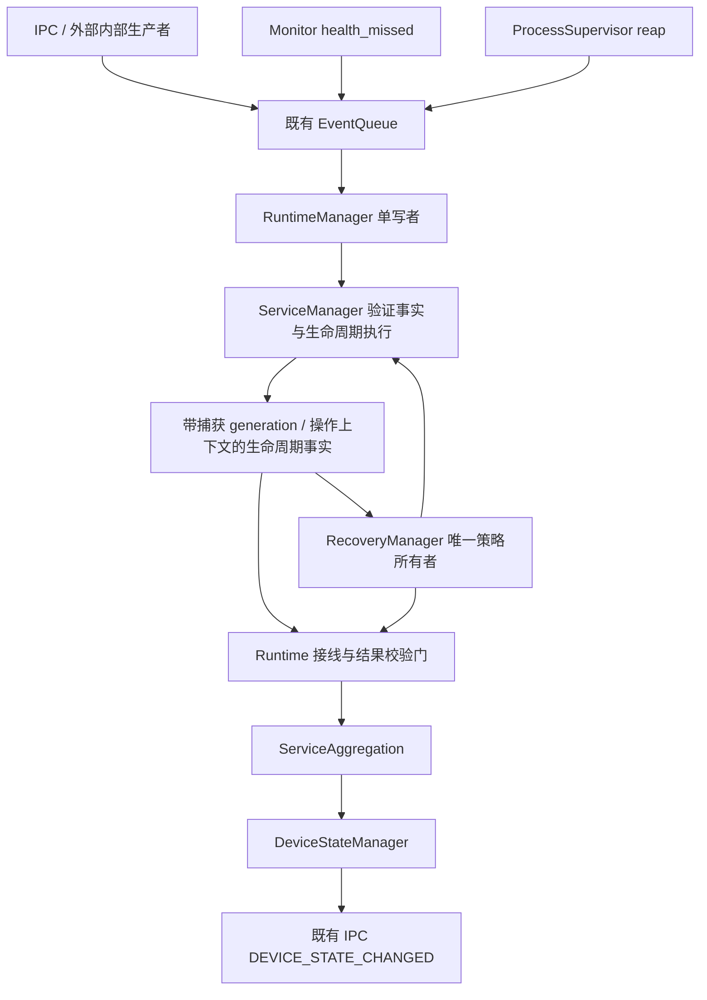

# Phase4 Architecture

## 现有结构上的最小增量
新增 include/runtime/recovery.hpp、include/runtime/recovery_manager.hpp、src/runtime/recovery_manager.cpp，挂入 runtime_core。不创建另一个进程后端、事件总线、依赖管理框架或设备状态机。

箭头 DSM → RecoveryManager → ServiceManager 是 P3 概念边界；实际恢复请求由 Runtime 的具名、已验证失败事实适配器形成，不由设备 ERROR 反推失败服务。ERROR 可能来自资源或多个服务，可选服务普通故障甚至只有 WARNING。DSM 不增加 restart 回调，不查询服务决定动作。

## 职责 / 输入 / 输出
| 模块 | 负责、输入和输出 | 不负责 |
| --- | --- | --- |
| RecoveryManager | 消费已验证 failure、manual restart、生命周期执行完成、tick、stop/shutdown；管理单服务 active episode、累计自动预算、due/deadline、execution binding；输出执行指令、关联 Result 和规范化 recovery facts | 不写 ServiceState/PID/lifecycle generation，不处理 socket，不实现业务健康，不采集资源 |
| ServiceManager | 唯一生命周期写者；执行 begin/launch/finalize recovery primitives、显式 start/stop、停止闭包、SIGTERM/KILL 期限、PID 清除；输出捕获 token 的事实 | 不计算自动 retry/backoff，不自行调度 replacement，不判定 recovery terminal |
| RuntimeManager | 模块构造、队列、单写者调度、事实门、因果 drain、shutdown 入口 | 不保存另一份 retry counter/delay/active recovery set |
| ServiceAggregation | 保存具名健康和独立资源锁存，接受经过关联校验的事实，重新计算设备目标 | 不执行恢复、不另发策略结果 |
| DeviceStateManager | 显式表校验、快照提交、锁外通知 | 不触发进程动作 |
| Monitor | 心跳及现有资源输入事实；SM 接受后才转 HEARTBEAT_TIMEOUT | 不重启、不扩展 procfs 采集 |
| Event Layer | FIFO 投递、注册顺序、嵌套追加 | 不按 producer timestamp 排序、不承担策略 |
| IPC Manager | 保留帧与命令，manual restart 转内部请求；保留 SERVICE_STOP 通知 | 不保留 pending restart 轮询与 START 决策 |

## 线程与调度
RecoveryManager 没有独立线程；其 submit/observe/tick/cancel 只能在现有 Runtime writer 调用。跨线程结果走 EventQueue，查询走同步快照。Clock::steady_clock；计时使用 writer 的当前时刻，producer 时间仅审计。

每轮：处理一个 queued envelope → 排空 lifecycle/recovery 因果工作 → reap 并直接应用匹配退出事实 → SM.tick（只升级停止/检查启动）→ RM.tick（到期检查优先于 launch）→ 排空。不把已经 reap 的退出留到下一轮才检查 deadline，避免已完成进程误判超时。操作不能在 dispatcher subscriber 内递归调用 SM；subscriber 只追加 writer-local work，drain 结束后迭代执行，每个 launch 后再排空。

同一 writer turn 最多执行一个恢复 launch，候选按 due_time、startup_order 中的拓扑序确定；不跳过未到期、不健康依赖。多个服务仍可同时处于 backoff。普通显式 START 的 P2 prerequisite closure 保留；不能越过 active recovery 的 admission gate。

## 同步后端约束
现有 ProcessSupervisor::start 同步等待 exec，最长受 startup_timeout 约束，异常 rollback 的 waitpid 及内核不可中断进程并非硬实时有界（S12/S13）。不为此新增线程或重写 fork/exec。恢复 launch 使用剩余 deadline 与 startup_timeout 的较小值；不足一个整秒不 launch。返回后首先用实际 Clock::now 检查 deadline，再接受成功。
recovery_timeout 是 writer 可推进时的逻辑完成期限，不能保证系统调用卡死时准时发事件。一般情况下超时在 deadline 后首个 writer checkpoint 处理；排队负载、其他启动和系统调用可使通知迟到。实现/验收不得宣称硬实时上限。不可回收 PID 不得清除或重新启动；通过 terminal 结果结束 RECOVERING 后继续 cleanup。

## 资源和业务边界
已有 ResourceSeverity、reportResourceUsage 与来源锁存全部保留。Phase4 只提供未来 service-scoped failure ingress；未绑定 service/action 的资源压力只影响聚合，不能凭内存 critical 重启任意服务。Camera/V4L2/RKNN、MCU协议/算法、OTA业务、MQTT/云/数据库/Web、GPU/NPU监控、动态配置、复杂插件/规则/工作流框架均不进入本阶段。
