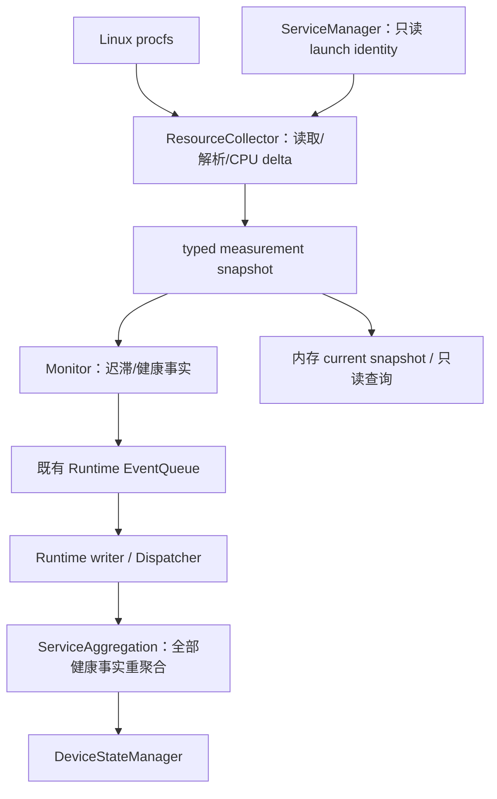

# Resource Collector Architecture

## 最小链路

Collector 只负责测量、有效性、CPU previous sample；不发 DeviceState、不决定 restart、不解析 ServiceConfig。Monitor 是系统资源阈值与迟滞唯一 owner。Runtime 构造/接线/模式准入/采样到期；ServiceManager 仍唯一持有 PID/launch generation；RecoveryManager 保留 P4 全部 policy 权限。

## 线程与数据归属

| 数据/动作 | owner / 同步 |
| --- | --- |
| timerfd | 既有 Timer thread，1s；不在 Timer thread 读 procfs |
| heartbeat check + native sample scheduling | 既有 Monitor worker；先 heartbeat check，再检查资源 due |
| raw proc text、CPU previous、process previous map | Collector，native worker 单线程调用 |
| resource hysteresis state | Monitor；独立小 mutex 支持保留 external report API；锁内只计算 state/facts，锁外 publish |
| identity snapshot | SM registry；批量复制后释放锁；不在锁内读 procfs |
| current resource snapshot | Runtime 内存 cache；短锁交换/复制；query 只读，不推进 policy |
| service lifecycle / recovery / aggregation / device state | 原 writer 与原 owner，采样 worker 不直接写 |
| runtime resource fact | 既有 FIFO EventQueue；dispatcher 只由 writer 调用 |

不要复用 heartbeat watches_ 的锁包住 procfs I/O；不要在 collector 回调中调用 SM start/stop。无每服务线程，无新增 resource/recovery thread。

## Native 与 external 模式

native：生产 runtime_manager 使用完整 RuntimeConfig 入口；只有 worker 是 cpu_monitor/memory_monitor 的测量生产者。外部 reportResourceUsage 在 native 模式拒绝（logic error，无发布）；public post 的保留 source cpu_monitor/memory_monitor 也拒绝，内置 ResourceSink 走 private queue adapter。其他合法 resource source 的原 public ingress 保留；不接恢复请求。

external：旧 config_path/ResourceThresholds 构造入口保留给已有集成及测试，不自动采集。reportResourceUsage 和 typed observation 使用同一个 Monitor policy。受信测试/部署若直接 post resource facts，必须独占该 source，不与百分比上报混用。直接 fact 是既有健康事实 ingress，不是第二个采集 policy。

模式只在构造时冻结，不能热切换。旧构造 external 与新生产入口 native 的差异必须在 README/实现报告说明，禁止把仅添加 collector 的库描述为 executable 已持续采集。

## 可测试边界

一个 read_text(path) callable 或等价窄 reader seam 返回文本/分类错误；parser 接受字符串。时钟使用既有 steady_clock；采样 due 与 policy 函数接受显式 now。禁止通用虚拟文件系统、依赖注入框架、metrics registry。

保留source准入检查须覆盖所有public资源入口，包括post(RuntimeEvent)以及post(Event)携带已封装runtime_event；不能只检查一个重载而允许envelope绕过。内置ResourceSink仅通过private adapter直接queue_.push，不能再经过public post。无需新增事件枚举或可由外部伪造的trusted标记。
